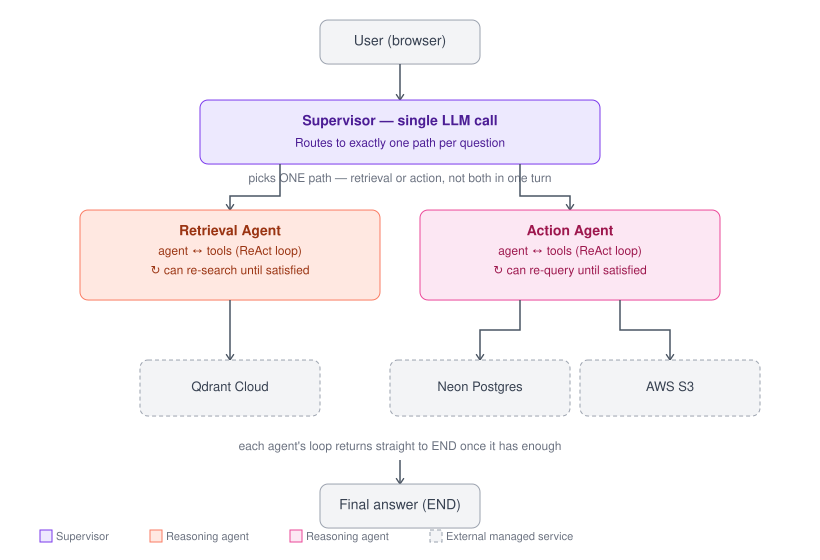

# Agent Flow

Multi-agent AI system that answers questions over uploaded documents and structured data. A LangGraph orchestrator routes each query through MCP tool servers — a retrieval agent with its own self-correcting reasoning loop, and an action agent for structured queries and report generation.

---

## 🏗 Architecture

Two containers, communicating over an internal Docker network via the Model Context Protocol:

1. **Streamlit UI (`streamlit-ui`)** — the public-facing app. Runs the LangGraph orchestrator, which decides which MCP tool(s) a query needs and assembles the final answer.
2. **MCP Server (`mcp-server`)** — an isolated backend service hosting the tools (document search, structured data queries, report generation). Not exposed publicly — the orchestrator reaches it internally at `http://mcp-server:8000`.



---

## 🤖 Multi-Agent Design

Three real agents, not one agent calling functions labeled "agents":

- **Supervisor** — one LLM call per question, routes to the retrieval agent, the action agent, or answers directly. Currently picks exactly one path per question — see Known Limitations.
- **Retrieval agent** — its own LLM instance running a ReAct loop (`agent` ↔ `tools`): it can call `search_documents` more than once if it judges the first results insufficient, deciding for itself when it has enough context before returning an answer.
- **Action agent** — built the same way as the retrieval agent: its own LLM instance, its own ReAct loop, over `query_structured_data` and `generate_report`. Not a plain deterministic wrapper — it makes its own decision about which tool to call and when it's done.

---

## ✨ Features

- **Live document upload** — drop a PDF into the chat UI; it's parsed, chunked, embedded, and indexed into Qdrant on the spot, with the raw file archived to S3 and metadata logged to Postgres.
- **Agentic RAG** — self-correcting retrieval, not a single fixed vector search.
- **Structured data queries** — the LLM picks from a fixed, closed set of query types (e.g. document count, recent tool-usage logs); each runs a predefined SQLAlchemy ORM query. The model never constructs SQL itself, so there's no injection surface at all.
- **Report generation** — synthesizes retrieved + structured data into a report written to S3.

---

## 🚀 Quick Start (Docker)

### 1. Clone the repository
```bash
git clone https://github.com/Harshilkothiya/Agent-Flow.git
cd Agent-Flow
```

### 2. Configure environment variables
```bash
cp .env.example .env
nano .env
```
Fill in your LLM API key, `DATABASE_URL` (Neon), `QDRANT_URL` + `QDRANT_API_KEY` (Qdrant Cloud), and AWS credentials.

### 3. Build and start
```bash
docker compose up -d --build
```
*(If you followed the EC2 setup and added your user to the `docker` group, you don't need `sudo` here.)*

The app is live at `http://localhost:8501` (or your server's public IP).

---

## 🛠 Tech Stack

* **Frontend:** Streamlit
* **Agent Orchestration:** LangGraph / LangChain
* **LLM:** Google Gemini (`gemini-3.6-flash`) via `langchain-google-genai`
* **Tool Protocol:** MCP (Model Context Protocol)
* **Databases:** Neon (serverless Postgres), Qdrant Cloud (vector DB)
* **Storage:** AWS S3
* **Infrastructure:** Docker & Docker Compose, deployed on AWS EC2

---

## 📌 Skills Demonstrated

| Area | Where it shows up |
|---|---|
| GenAI / multi-agent systems | LangGraph orchestrator + retrieval agent's own reasoning loop |
| MCP | Real MCP server, tools consumed via `langchain-mcp-adapters` |
| RAG | Qdrant vector search with query rewriting and relevance grading |
| Cloud | AWS EC2 + S3, managed Postgres (Neon) and vector DB (Qdrant Cloud) |
| Docker | Multi-container app, containerized build and deploy pipeline |

---

## 🛑 Stopping and Restarting

```bash
docker compose stop      # stop without deleting containers
docker compose start     # start them again
docker compose up -d --build   # rebuild after code or dependency changes
```

---

## 📋 Known Limitations

- Single EC2 instance, no auto-scaling or redundancy.
- Document search isn't scoped per session — uploads are visible to any query against the shared knowledge base.
- The Supervisor routes each question to exactly one path (retrieval OR action) rather than combining both in a single turn — a question needing both document context and structured data currently only gets one of the two.
- `query_structured_data` is intentionally limited to a fixed set of predefined queries, not open-ended SQL generation, to keep the attack surface bounded.
- The retrieval and action agents can retry their own tool calls, but there's no separate explicit relevance-grading step — retry decisions are made implicitly by the same LLM call that decides what to do next, not a dedicated grading node.